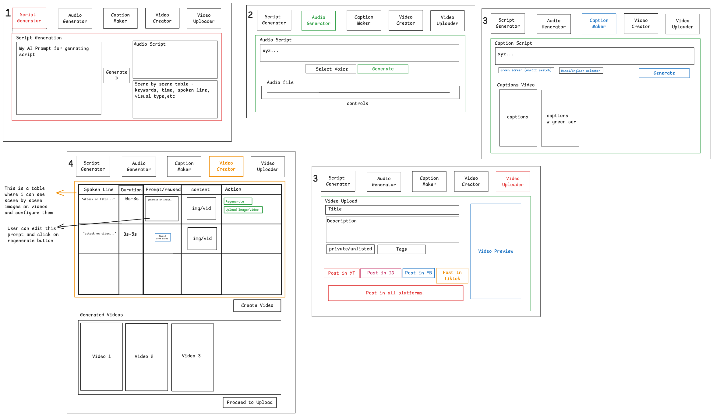

Use this prompt directly with Claude along with the wireframe image:

---


# YouTube Shorts Automation Dashboard




I want you to build a **personal internal dashboard** that helps me create and publish YouTube Shorts extremely quickly.

This is NOT a SaaS product.

This is NOT a multi-user platform.

This is a tool only for me.

The goal is to reduce the entire workflow of creating a YouTube Short from 30-60 minutes down to under 5 minutes.

The dashboard should be built using:

* React
* TypeScript
* TailwindCSS
* ShadCN UI

The design should follow the attached wireframe image, but it should look modern, polished, clean and professional.

The dashboard should feel like a content creation operating system rather than a simple form.

---

# Core Concept

Everything revolves around a Workspace.

A workspace represents one short video project.

Examples:

```text
Dwarka Mystery
Attack On Titan Fact
Kailasa Temple
Why Humans Dream
```

Each workspace should contain:

```text
Script
Audio
Captions
Assets
Video
Upload Data
Generated Outputs
```

I should be able to:

* Create Workspace
* Rename Workspace
* Duplicate Workspace
* Delete Workspace
* Open Existing Workspace
* Resume Workspace Later

Example:

```text
Workspaces

- Dwarka Mystery
- Chanakya Strategy
- Future Of AI
- Attack On Titan Facts
```

When I open a workspace, all previous progress should still exist.

---

# Dashboard Structure

The dashboard should have 5 major tabs:

```text
1. Script Generator
2. Audio Generator
3. Caption Maker
4. Video Creator
5. Video Uploader
```

The workflow moves left to right.

Each tab should show:

```text
Completed
In Progress
Not Started
Failed
```

status indicators.

---

# 1. Script Generator

This is where the entire video starts.

The page should contain:

### Prompt Editor

Large textarea.

This contains my AI prompt.

I should be able to:

* Edit Prompt
* Save Prompt
* Load Prompt Templates
* Create Prompt Templates

Example:

```text
Hindi Facts Prompt
Business Facts Prompt
Anime Facts Prompt
```

### Topic Input

Example:

```text
Dwarka Mystery
Kailasa Temple
Meditation And Science
```

### Generate Button

When clicked:

Generate:

### Voiceover Script

Editable text area.

I should be able to modify anything manually.

### Scene Breakdown

Generate structured scene data.

Each scene should contain:

```text
Scene Number
Start Time
End Time
Spoken Line
Visual Type
Keywords
Visual Description
AI Image Prompt
```

Example:

```text
Scene 1

Spoken Line:
"Scientists recently discovered..."

Duration:
0-3 seconds

Visual:
Brain neurons animation

Keywords:
brain
neurons
science

Image Prompt:
Ultra realistic neuron network...
```

Every scene should be editable.

---

# Script Versioning

Every time I regenerate:

Save a version.

Example:

```text
Version 1
Version 2
Version 3
```

I should be able to restore previous versions.

---

# 2. Audio Generator

This page converts script into voice.

Display:

### Script Preview

Show current script.

### Voice Selection

List available voices.

### Generate Audio

Generate narration.

Display:

```text
Audio Player
Duration
File Size
Generation Time
```

I should be able to:

* Replay
* Regenerate
* Download
* Replace

Store generated audio inside workspace.

---

# Audio History

Keep previous audio generations.

Example:

```text
Audio v1
Audio v2
Audio v3
```

Allow switching between them.

---

# 3. Caption Maker

This page converts audio into captions.

Show:

### Audio Preview

Current audio.

### Caption Settings

Options:

```text
Hindi
English
Bilingual
```

### Caption Style Settings

Allow customization:

```text
Font
Font Size
Font Weight
Text Color
Stroke Color
Stroke Width
Highlight Color
Position
```

### Generate Captions

Generate:

```text
SRT
Word-Level Timestamps
Caption JSON
```

Display editable captions.

---

# Caption Preview

Show live preview.

Display:

```text
Normal Captions
Highlighted Captions
Green Screen Captions
```

I should instantly see changes.

---

# 4. Video Creator

This is the most important page.

The goal is to make video creation extremely fast.

The center of the page should be a Scene Table.

Each row represents one scene.

Columns:

```text
Spoken Line
Duration
Keywords
Prompt
Selected Asset
Actions
```

---

# Scene Asset Management

For every scene:

Display:

```text
Current Image
Current Video
```

Allow:

```text
Upload Image
Upload Video
Replace Asset
Delete Asset
Preview Asset
```

---

# AI Asset Suggestions

For every scene:

Generate:

### Search Keywords

Example:

```text
underwater ruins
ancient city
lost civilization
```

### AI Image Prompt

Example:

```text
Ultra realistic underwater ancient city...
```

### Stock Asset Suggestions

Display:

```text
Suggested Videos
Suggested Images
```

I can choose one with a click.

---

# Asset Library

Workspace should contain:

```text
Images
Videos
Generated Images
Downloaded Assets
```

Everything used in the project should be visible.

---

# Scene Controls

For each scene:

Choose:

```text
Image
Video
Animation
Split Screen
```

Effects:

```text
Zoom In
Zoom Out
Pan Left
Pan Right
Ken Burns
Parallax
```

Transitions:

```text
Fade
Slide
Zoom
Crossfade
```

---

# Scene Regeneration

Each scene should have:

```text
Regenerate Suggestions
Regenerate Keywords
Regenerate Prompt
```

without affecting the rest of the project.

---

# Video Rendering

Click:

```text
Create Video
```

Show:

```text
Rendering Progress
Current Scene
Estimated Time Remaining
```

When complete:

Show preview.

Store multiple renders.

Example:

```text
Render 1
Render 2
Render 3
```

---

# Video Gallery

Below the editor:

Display all generated videos.

Show:

```text
Thumbnail
Duration
Resolution
Render Date
```

Allow:

```text
Preview
Rename
Delete
Download
```

---

# 5. Video Uploader

This page prepares publishing.

Show:

### Video Preview

Current selected video.

### SEO Section

Fields:

```text
Title
Description
Tags
```

### AI Assistance

Generate:

```text
Title Suggestions
Description Suggestions
Tag Suggestions
```

Allow one-click insertion.

---

# Upload Targets

Initially:

```text
YouTube
```

Future:

```text
Instagram
Facebook
TikTok
X
```

Design the UI so new platforms can easily be added later.

---

# Publishing

Options:

```text
Public
Private
Unlisted
```

Show upload progress.

Show success message.

Show video URL after upload.

---

# Dashboard Home

Create a homepage showing:

### Workspace List

### Recent Projects

### Recently Generated Videos

### Upload Statistics

Example:

```text
Videos Generated
Videos Uploaded
Total Views
```

Placeholder for now.

---

# User Experience Goals

The dashboard should feel:

```text
Fast
Modern
Minimal
Professional
Productivity Focused
```

Avoid clutter.

Avoid excessive animations.

Every action should require as few clicks as possible.

The primary goal is to help me go from:

```text
Topic
↓
Script
↓
Audio
↓
Captions
↓
Assets
↓
Video
↓
Upload
```

in the shortest time possible.

Build this project in phases.

Start with Workspace Management and Script Generator first.

Do not build everything at once.

First create the architecture, UI structure, routing, workspace system and Script Generator module. Then wait for approval before moving to the next phase.

---

Also use the attached wireframe image as the primary reference for layout and workflow.
