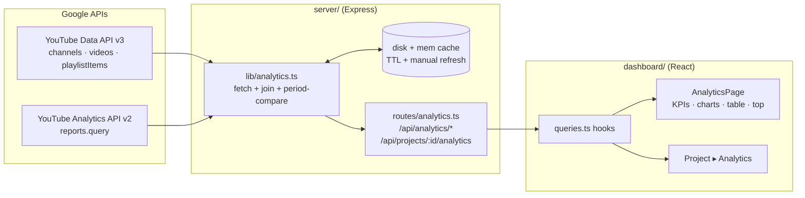
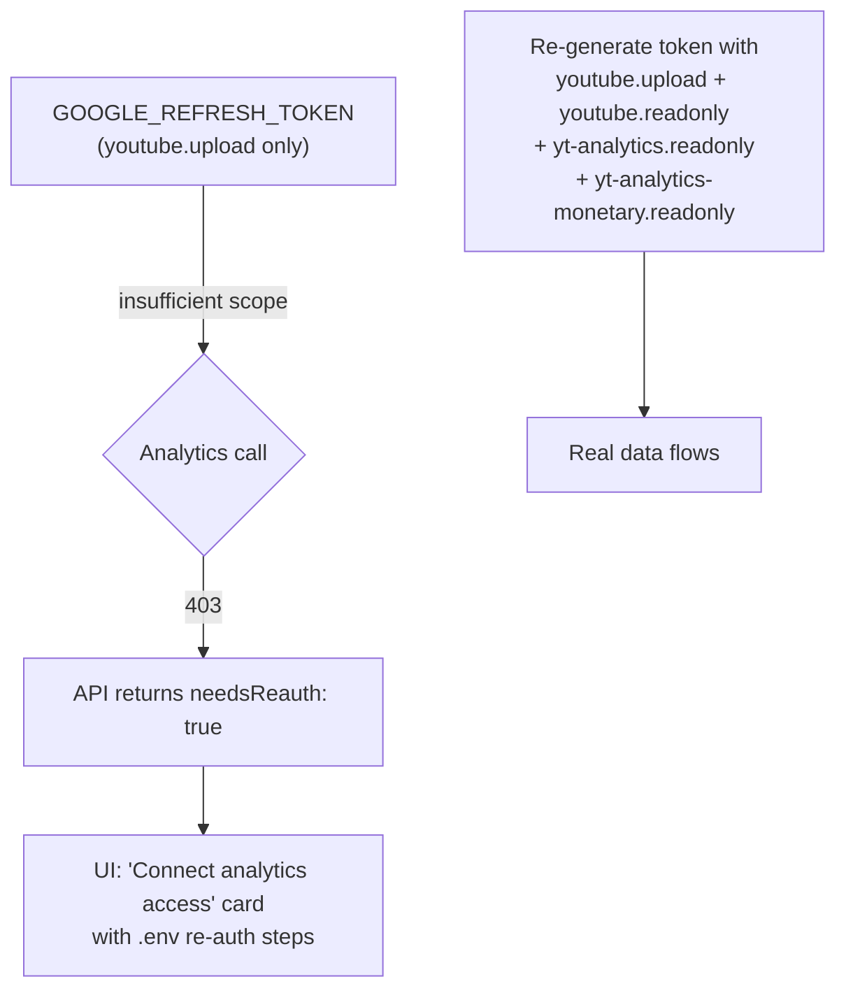
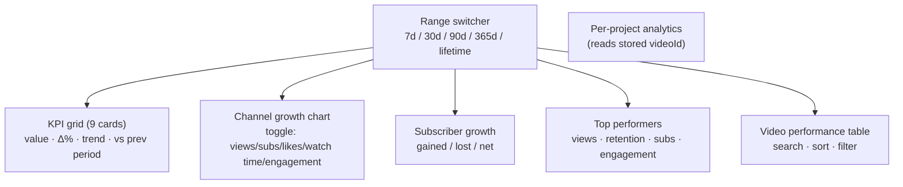
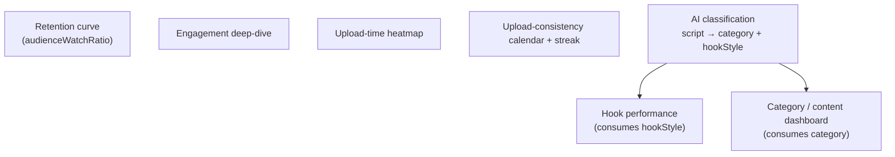
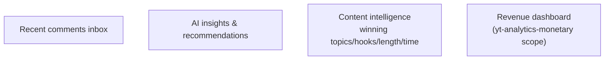

# Analytics & Content Intelligence — Implementation Plan

This is the phased build plan for the Analytics module specified in
[`Analytics.md`](./Analytics.md). It tracks what ships now (Phase 1) and what is
deferred, plus the architecture all phases share.

## Decisions

| Topic | Decision |
| --- | --- |
| Phase 1 scope | Core channel dashboard (KPIs, growth chart, video table, top performers, per-project analytics) |
| Data source | Real YouTube Data + Analytics APIs; user re-auths with analytics scopes |
| Category / hook style | AI-classified from the script (deferred to Phase 2 dashboards; schema fields added now) |
| Charts | shadcn charts (Recharts under the hood) |

## Auth & scopes

The uploader's refresh token is `youtube.upload` only. Analytics needs a token
regenerated with the additional scopes below, and the **YouTube Analytics API**
enabled in Google Cloud Console.

## Phase 1 — Analytics Command Center (this build)

**Backend**
- `lib/analytics.ts` — Data API (`channels.list mine`, `videos.list`,
  `playlistItems.list` for the uploads universe) + Analytics API
  (`reports.query` with `day` and `video` dimensions). Joins per-video metrics
  with snippet/thumbnail. Current-vs-previous window for KPI deltas. In-memory +
  on-disk cache keyed by range (TTL ~30 min) with manual refresh. 403/insufficient
  scope → `{ needsReauth }`.
- `routes/analytics.ts` — `/api/analytics/{status,overview,timeseries,videos,top,refresh}`
  and `/api/projects/:id/analytics`.

**Frontend**
- `recharts` + `components/ui/chart.tsx` (shadcn chart primitives, themed to tokens).
- Rebuilt `AnalyticsPage.tsx` (command center) + `ProjectAnalyticsPage.tsx`
  (link in the project header).

**Groundwork (no dead code):** add `category` + `hookStyle` to the project
schema. Population via AI classification ships in Phase 2 — scripts are persisted,
so classification can run retroactively with no backfill loss.

## Phase 2 — Content intelligence

## Phase 3 — Decision system

## Verification (Phase 1)

- Server + dashboard typecheck/build.
- Backend smoke: `needsReauth` path (no analytics scope) and, once re-authed,
  real `overview`/`timeseries`/`videos`. Throwaway project for the per-project
  endpoint. Dark-mode screenshots. Cleanup leaving user projects untouched.
