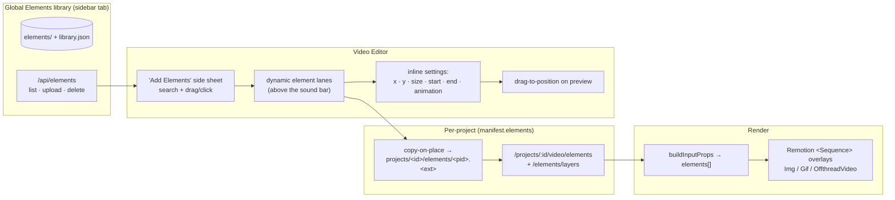
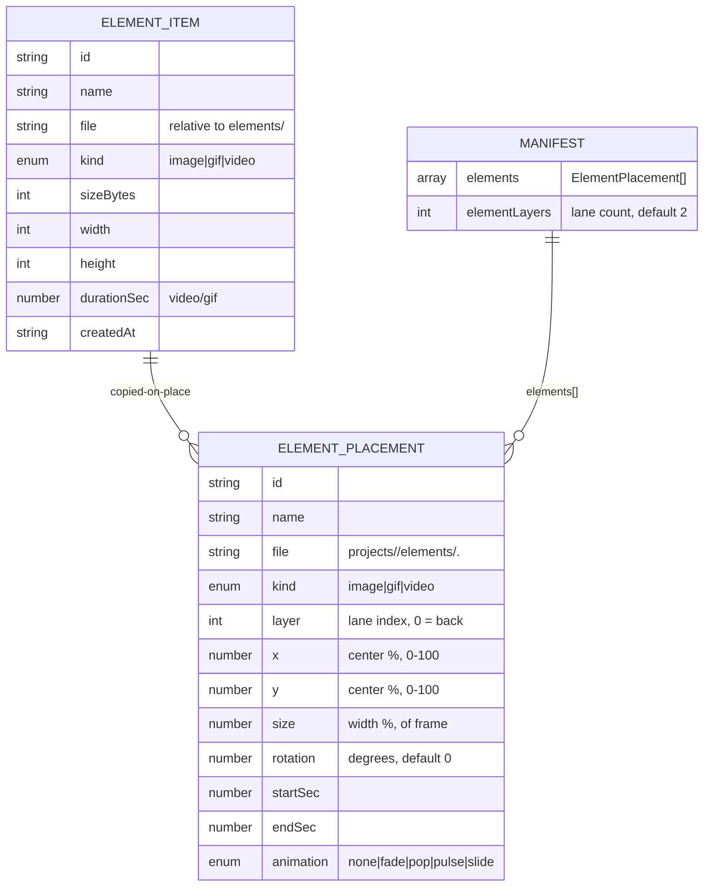
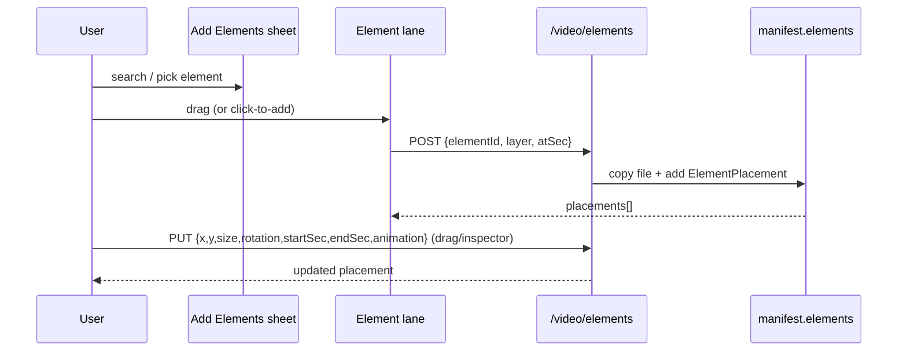
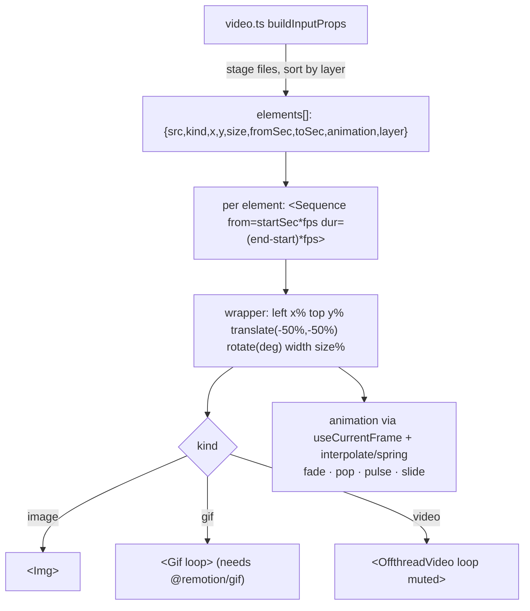
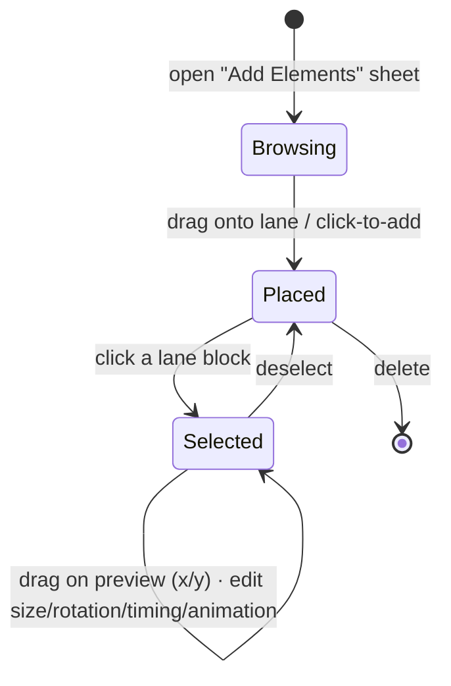

# Elements — Implementation Plan

## Context

Today the Video Editor lets users place **sound effects** on a timeline bar (drag-and-drop, per-second
ruler) and renders them as timed audio. There is no way to overlay **visual elements** — a pointing
arrow, a "Subscribe" gif, a badge — on top of the video. This plan adds **Elements**: a reusable
global library of image/gif/video overlays, placed on the project timeline with a position (x/y),
size, time range, and an optional animation, and composited into the final render.

Elements mirror the existing **sounds** architecture end-to-end (global library → copy-on-place into
the project → manifest placements → timed Remotion sequences), so most of the design is "the sounds
pattern, for visuals."

### Decisions (confirmed)

| Topic | Decision |
| --- | --- |
| Per-element controls | **x, y, size, rotation, start, end, animation** (opacity deferred) |
| Position UX | **Drag on the preview** + numeric x/y fields (kept in sync) |
| Layers | **Dynamic** element lanes (add/remove), top lane = front-most |
| Side-sheet scope | **Elements only** now; sounds picker stays inline (audio sheet is a later follow-up) |
| Library | **New global Elements library** (mirrors the sounds library) |

---

## Architecture / data flow

---

## Data model

`x`/`y` are the element **center** as a percentage of the frame; `size` is the element **width** as a
percentage of frame width (height derived from the asset's aspect). Percentages keep everything
resolution-independent between the (scaled) preview and the 1080×1920 render.

- New global lib `server/src/lib/elements.ts`: `GLOBAL_ELEMENTS_DIR = ROOT/elements`, `library.json`
  index. `ElementItem` as above; kind detection splits **gif into its own kind** (image regex minus
  gif; gif regex; video regex). `getElementLibrary() / addElement({buffer,originalName}) /
  deleteElement(id)`. Width/height probed best-effort (ffprobe) for default sizing.
- `schema.ts`: add `ElementPlacement` (incl. `rotation`, default `0`) + `Manifest.elements` (default
  `[]`) and `Manifest.elementLayers` (default `2`). Additive defaults so existing manifests parse.

---

## Backend

**Global library routes** (`server/src/routes/elements.ts`, mounted `/api/elements`):

| Method | Path | Action |
| --- | --- | --- |
| GET | `/api/elements` | list `ElementItem[]` |
| POST | `/api/elements` | multipart `file` → `addElement` |
| DELETE | `/api/elements/:id` | `deleteElement` |

Static files served at **`/element-lib`** (not `/elements`, which is the client route) + a Vite proxy
entry. Mount both in `server/src/index.ts`.

**Per-project placements** (`store.ts` mutators + `lib/elements.ts` `placeElement`; routes added to
`server/src/routes/video.ts`, mirroring the sound endpoints):

| Method | Path | Action |
| --- | --- | --- |
| GET | `/projects/:id/video/elements` | list placements |
| POST | `/projects/:id/video/elements` | `{ elementId, layer, atSec }` → copy-on-place, defaults `x:50 y:50 size:30 rotation:0 start=atSec end=atSec+3 animation:none` |
| PUT | `/projects/:id/video/elements/:pid` | `{ x?, y?, size?, rotation?, startSec?, endSec?, layer?, animation? }` |
| DELETE | `/projects/:id/video/elements/:pid` | remove placement + file |
| POST/DELETE | `/projects/:id/video/elements/layers` | add / remove (empty) lane |

---

## Render

- `video.ts buildInputProps`: assemble `elements[]` (stage files like sounds; filter missing; sort by
  `layer`; pass `rotation`; clamp `endSec` to total duration).
- **Add `@remotion/gif`** to dependencies — `` only shows a gif's first frame, so animated gifs
  need `<Gif>`. Videos loop via `<OffthreadVideo loop muted>`.
- New `remotion/components/Elements.jsx`; layered in `remotion/Video.jsx` **above scenes, below
  captions** (z-order; revisit if arrows must sit over captions). Lane order within the element layer
  = z-order (higher layer renders later/on top).

---

## Frontend

**Global management**
- `RootLayout` NAV: add **Elements** tab (lucide `Shapes` or `Sticker`); `router.tsx`: `/elements`.
- `dashboard/src/pages/ElementsPage.tsx`: upload + delete + grid (mirrors `AssetsPage`); gifs preview
  natively via ``, videos via `<video>`.
- types/api/queries: `ElementItem`, `ElementKind`; `listElements/uploadElement/deleteElement` +
  `useElementLibrary/useUploadElement/useDeleteElement`.

**Video Editor** (`dashboard/src/pages/VideoEditorPage.tsx`)

- New **`Sheet`** component (Radix Dialog as a right drawer + slide-from-right keyframe). "Add
  Elements" sheet = search + grid; items are **draggable** (`application/x-element-id`) **and**
  **click-to-add** (drops on the active lane at the playhead) — robust even when the drawer overlaps
  the timeline.
- **Timeline**: unify into a stacked timeline with one shared ruler — **N dynamic element lanes**
  (top = front-most) above the existing **sound bar**, with **+ Add layer** / remove-empty-lane.
  Lanes reuse the `SoundTrack` ruler + `xToSec` + draggable-block mechanics.
- **Preview** (`EditorPreview`): render in-range element overlays by x/y/size; the **selected**
  element is **draggable on the preview** (pointer → update x/y %, debounced); numeric x/y in the
  inspector stay in sync.
- **Right-panel "Elements" section** (inline, per the mockup): "+ Add Element" opens the sheet;
  selecting a placement shows **x · y · size · rotation · start · end (+ "whole video" toggle) ·
  animation · delete** — mirroring the selected-sound inspector.
- types/api/queries: `ElementPlacement`; `getProjectElements/placeElement/updateElement/
  removeElement/setElementLayers` + matching `useProjectElements/usePlaceElement/useUpdateElement/
  useRemoveElement/useSetElementLayers` (invalidate the project-elements query).

---

## Critical files

- New: `server/src/lib/elements.ts`, `server/src/routes/elements.ts`,
  `remotion/components/Elements.jsx`, `dashboard/src/pages/ElementsPage.tsx`,
  `dashboard/src/components/ui/sheet.tsx`.
- Edit backend: `server/src/lib/{schema,store,video}.ts`, `server/src/routes/video.ts`,
  `server/src/index.ts`, `dashboard/vite.config.ts` (proxy `/element-lib`), root `package.json`
  (`@remotion/gif`), `remotion/Video.jsx`.
- Edit frontend: `dashboard/src/lib/{types,api,queries}.ts`, `dashboard/src/layouts/RootLayout.tsx`,
  `dashboard/src/router.tsx`, `dashboard/src/pages/VideoEditorPage.tsx`.

---

## Verification (at implementation time)

1. `cd server && npm run typecheck`; `cd dashboard && npm run typecheck && npm run build`.
2. Backend smoke (throwaway project, separate `DASH_PORT`): upload an element to the global library;
   `POST /video/elements` places it on a lane; `PUT` updates x/y/size/timing/animation; add/remove a
   lane; `DELETE` removes placement + file.
3. Render the project → the element appears at the right position, only within its time range, on the
   correct layer; an **animated gif overlay actually animates**; verify with `ffprobe` + frame grabs
   at in-range vs out-of-range timestamps.
4. Headless-Chrome screenshots (dark): Elements sidebar page; "Add Elements" side sheet; element
   lanes above the sound bar; an element selected with the preview drag-handle + inline settings.
5. Clean up the throwaway project + temp files; stop the test server. **Leave user projects
   `blackhole-fact-2y66tu`, `tenst-a3b2rq`, `test-e3r6po`, `test-nom-dbw10z` untouched.**

## Deferred (later)
- Opacity per element (additive field, no migration).
- Element z-order vs captions (currently below captions).
- Move the Sound-effects picker into an "Audio Settings" side sheet (matches the original mockup).
