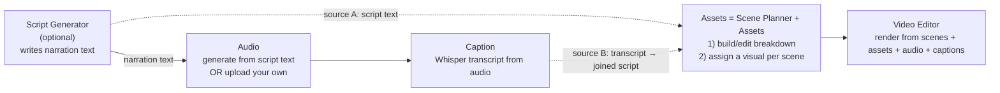

# Plan: Decouple Script ↔ Assets — make the scene breakdown source-agnostic & editable

_Status: IMPLEMENTED (2026-06-21). Decisions applied — D1 narration-only; D2 option (a)
manifest.scenes canonical + assets layer kept; D3 edit-only (add/remove later); D4 plain join;
D5 breakdown persisted in the backend at `manifest.scenes`, not in script versions._

## 1. Problem

Today the **Script Generator** does two jobs in one LLM call: it writes the narration
(`voiceoverScript`) **and** plans the scene-by-scene visual timeline (`scenes[]` with
`searchKeywords`, `visualType`, `imagePrompt`, `visualDescription`, durations). Downstream:

- **Audio** needs the narration text (or you upload your own audio → needs nothing).
- **Caption** needs the audio (not the script).
- **Assets** and **Video Editor** need the **scene breakdown**.

So if you skip the AI Script step (bring your own script, or just upload audio at step 2),
Captions still work, but **Assets is dead** — there's no scene breakdown to hang keywords/assets on.

## 2. Core principle (the fix)

> The scene breakdown is **derived from a full narration text**, not from "the AI script."
> That text can come from **either** source, and the breakdown + all its fields are **fully editable**.

```
full narration text  ──(one LLM "director" pass)──►  scenes[]  ──(edit freely)──►  assign assets
```

Where the narration text comes from:
1. **Script Generator output** is present → use it.
2. **No script, but a caption transcript exists** → join the transcript's word-chunks back into a
   full script string → use that.

Because `durationSec`, `searchKeywords`, `imagePrompt`, `visualDescription`, and `spokenLine` are all
**editable per scene**, exact timing/length never matters — if an asset feels too long/short you just
change `3s → 1s`, etc. This is what removes the need to lean on caption *timings* (so Assets is **not**
coupled to Captions — it only needs *some* narration text, from whichever step produced one).

## 3. Target pipeline & dependencies



Key point: the dotted arrows are **alternatives**. Assets needs *a narration source* — either the
Script step's text **or** the transcript — never both, and never a hard dependency on a specific step.

## 4. What changes, step by step

### 4.1 Script Generator → narration-only (independent)
- Its canonical output becomes just the **narration script** (`voiceoverScript`) — a clean, editable
  block of text, with the existing templates/topic/versioning/restore.
- It **no longer owns the scene breakdown UI.** (The scene table + per-field editing moves to Assets.)
- Still optional: you can skip it entirely and go straight to Audio (upload) → Caption → Assets.

> **Decision to confirm (D1):** make Script narration-only (recommended), vs. keep it producing a
> draft breakdown that Assets merely reuses. Recommended = narration-only for true independence;
> cost is one extra LLM call in the all-AI path (one call to write, one to break down).

### 4.2 Assets → "Scene Planner + Assets" (the new home of the breakdown)
- **Empty state:** if there's no breakdown yet, show a **"Build scene breakdown"** action. It picks
  the source automatically and tells you which it used:
  - script text if present, else the joined caption transcript;
  - if neither exists → prompt the user to generate a script or add audio + captions first.
- **Breakdown generation:** send the full narration text to the LLM "director" prompt → get
  `scenes[]`. The LLM **must not change the words** — it splits the provided narration verbatim into
  consecutive scenes and adds the visual fields. (Critical so uploaded-audio narration stays intact.)
- **Editable per-scene fields** (mirrors today's Script tab, now here): `spokenLine`, `durationSec`,
  `visualType`, `searchKeywords`, `imagePrompt`, `visualDescription`.
- **Per-scene asset assignment** (today's Assets functionality): stock search/select, upload,
  auto-fill, library — unchanged, just sitting next to the editable breakdown row.
- **Add / remove / reorder scenes** manually (nice-to-have; at minimum edit durations + fields).
- "Regenerate breakdown" re-runs the director pass (replaces unsaved structure, like a re-transcribe).

### 4.3 Audio, Caption, Video Editor
- **Audio:** unchanged (generate from `voiceoverScript`, or upload). Speed slider as-is.
- **Caption:** unchanged (Whisper from audio). Words-per-line knob as-is.
- **Video Editor:** unchanged in spirit — it already reads the breakdown + assets + audio + captions.
  It just reads the breakdown from its new canonical home (see §5).

## 5. Data model

Make the breakdown a **canonical, manifest-level artifact** instead of living inside a script version.

- **New:** `manifest.scenes: Scene[]` is the editable breakdown. Each `Scene`:
  `{ scene, start, end (or durationSec), spokenLine, visualType, searchKeywords[], imagePrompt, visualDescription }`.
- **Asset selection** stays associated per scene. Two clean options (finalize at implement time):
  - (a) keep `manifest.assets.scenes[]` keyed by `sceneNumber` for `{ candidates, selected }` and
    align by scene number (smallest change), or
  - (b) merge `selected` into each `manifest.scenes[i]` and keep only the transient `candidates`
    cache in `assets`. Recommended (b) long-term; (a) is the smaller diff.
- **Script versions** keep `voiceoverScript`; they no longer need to be the source of truth for
  scenes (can stop persisting `scenes` there, or keep for history — TBD, low stakes).

### Backfill / backwards compatibility
- On read, if `manifest.scenes` is empty **but** the current script version has `scenes`, backfill
  `manifest.scenes` from it once. So existing workspaces (e.g. ones already built) keep working with
  zero user action.
- `manifest.assets.scenes` already exists and is keyed by scene number — keep aligning by number.

## 6. Backend changes

- **Prompt split** (`server/src/lib/llm/prompt.ts`): split today's master prompt into
  - a **writer** prompt → narration only (`voiceoverScript`), used by the Script step;
  - a **director** prompt → input is a full narration string, output is `scenes[]` only, with a hard
    rule: *segment the given narration verbatim; do not paraphrase; add visual fields only.*
  - Reuse the existing **strategy pattern** (DeepSeek → OpenAI → mock) for both.
- **Breakdown service + route**: e.g. `POST /api/workspaces/:id/assets/breakdown` →
  resolves the source (script text → else joined transcript), runs the director pass, writes
  `manifest.scenes`, returns it. (Joining the transcript = concatenate `caption.lines` / `words` text.)
- **Store** (`server/src/lib/store.ts`): canonical `manifest.scenes` getter/setter + per-scene edit
  mutators (update fields, add/remove/reorder), plus the backfill described above.
- **Schema** (`server/src/lib/schema.ts`): `Scene` already exists; promote `manifest.scenes` to the
  typed `Scene[]` (it's currently `z.any()`), with `.default([])` so old manifests parse.

## 7. Frontend changes (high level)
- **ScriptPage:** drop the scene table; keep topic + template + editable narration text + versions.
- **AssetPage:** becomes the Scene Planner + Assets — breakdown build/regenerate, the editable
  per-scene fields, and the existing asset assignment UI together. Reads/writes `manifest.scenes`.
- **VideoEditorPage:** point its scene reads at `manifest.scenes` (was `script.scenes`).
- **types/api/queries:** add `scenes` to the manifest type; add `useBuildBreakdown` +
  per-scene edit mutations; the asset hooks stay.

## 8. Open decisions to confirm (please mark on re-read)
- **D1 — Script step:** narration-only (recommended) vs. keep a draft breakdown it owns.
Ans - narration only
- **D2 — Asset data model:** (a) keep `assets.scenes` keyed by number (small diff) vs. (b) merge
  `selected` into `manifest.scenes` (cleaner). 
Ans - whichever do you think is best.
- **D3 — Manual scene add/remove/reorder in Assets:** in v1, or just edit fields/durations for now?
Ans - Manual scene add/remove/reorder will be done in later, just work on edit fields/durations 
- **D4 — Transcript→script join:** plain concatenation of caption lines is fine? (We ignore caption
  *timings* entirely; we only reuse the words as a text source.)
Ans - Fine
- **D5 — Script-step `scenes`:** stop persisting on script versions, or keep for history?
Ans - its fine to not store scenes in script version, but confirm me if we are storing the scenes in BE that gets generated in assets page or not. 

## 9. Non-goals (for this round)
- Changing audio/caption/video-editor behavior beyond where they read `scenes`.
- Using caption *timings* to drive durations (explicitly avoided — durations are user-editable).
- AI image generation (still deferred).

## 10. Verification plan
- **All-AI path:** Script → narration; Audio (gen/mock) ; Caption; Assets → Build breakdown from
  script text → editable scenes appear → edit a duration & keywords → assign assets → Video Editor
  renders.
- **Bring-your-own-audio path:** new workspace → skip Script → upload audio → generate captions →
  Assets → Build breakdown from **transcript** → scenes appear → assign assets → render.
- **Bring-your-own-script path:** paste narration into Script (no AI) → Assets builds breakdown from it.
- **Backfill:** open an existing workspace that already has script `scenes` → `manifest.scenes`
  backfills, Assets/Video Editor work unchanged.
- Typecheck (server + dashboard), build, and a real end-to-end render. Leave `test-e3r6po` untouched.
