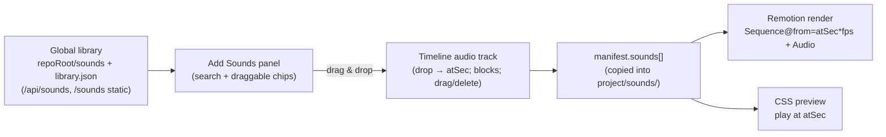

# Plan: Global sound library + timeline sound effects (Video Editor)

_Status: DRAFT for review. No code yet. Scene reorder/insert/remove is explicitly **out of scope**._

## 1. Goal

Let me drop short sound effects onto a video at any point in time.

- Sounds come from a **global** library (my own uploaded sounds — **no external provider**), shared
  across **all** projects (not project-scoped).
- **Drag & drop** a sound from an "Add Sounds" panel onto a new **audio track below the timeline**;
  it shows there as a block at the time I dropped it.
- Placed sounds are **mixed into the render** and **audible in the preview**.
- Redesign the Audio panel: **Narration + Captions side by side**, a **Background Audio** row, and an
  **Add Sounds** panel (toggle + "Search Sounds" + a grid of sound chips).
- Seed a few **sample sounds** now. A dedicated "Manage sounds" page comes **later** (for now, upload
  inline from the Add Sounds panel).

## 2. Two layers (data model)

### A) Global sound library — app-level, not per-project
- Files live at **`<repoRoot>/sounds/`** with an index **`<repoRoot>/sounds/library.json`**.
- `SoundItem = { id, name, file, durationSec, sizeBytes, createdAt }` (`file` relative to the sounds dir).
- Served read-only at a new static route **`/sounds/<file>`** (sibling of `/media`), and listed via a
  new **app-level** API (`/api/sounds`, *not* under `/projects/:id`).
- **Sample seeding:** on first read, if the index is empty, generate ~5 short sounds with ffmpeg
  (e.g. `pop` 0.15s, `click` 0.2s, `ding` 0.5s, `whoosh` 0.8s, `chime` 1s) into `sounds/samples/` and
  index them. Clearly placeholders; real ones get added by the user.

### B) Per-video placements — in the project manifest
- `manifest.sounds: SoundPlacement[]`.
- `SoundPlacement = { id, name, file, atSec, durationSec, volume }`.
- **Copy-on-place (recommended):** dropping a global sound copies its file into
  `projects/<id>/sounds/<placementId>.<ext>` and records a placement. This keeps the project
  self-contained (served via `/media`, staged for render like every other asset) and means deleting a
  global library sound never breaks an existing video. The global library is just the palette.
- **Timing is absolute video time** (`atSec` on the final timeline) — "anywhere in the video".
  Full-length playback (these are 1–2s; no trimming in v1). Per-placement `volume` (default 1).

## 3. Backend

### Global sounds (new, app-level)
- `server/src/lib/sounds.ts`: `soundsDir` (`<ROOT>/sounds`), `getSoundLibrary()` (read index; seed
  samples via ffmpeg if empty), `addSound({buffer, name})` (write + ffprobe duration + index),
  `deleteSound(id)`.
- `server/src/routes/sounds.ts` mounted at **`/api/sounds`** (top-level in `index.ts`, beside
  `/api/projects`): `GET /` (list), `POST /` (multipart upload), `DELETE /:id`.
- `server/src/index.ts`: `app.use('/sounds', express.static(soundsDir))` + mount `soundsRouter`.

### Per-video placements
- `schema.ts`: add `SoundPlacement` and `manifest.sounds: z.array(SoundPlacement).default([])`.
- `store.ts`: `soundsDir(id)` (`projects/<id>/sounds`), `getSounds(id)`, `addSoundPlacement(id, rec)`,
  `updateSoundPlacement(id, placementId, patch)` (atSec, volume), `removeSoundPlacement(id, placementId)`.
- `lib/video.ts` (or `lib/sounds.ts`): `placeSound({ id, soundId, atSec })` → resolve the global
  sound, copy its file into the project, ffprobe duration, push a placement.
- Routes under `/:id/sounds` (new nested router, or fold into the video router): `GET /`,
  `POST /` `{soundId, atSec}`, `PUT /:placementId` `{atSec?, volume?}`, `DELETE /:placementId`.

### Render
- `buildInputProps`: when `timeline.soundsEnabled`, stage each placement file into
  `remotion/public/assets/sound-<i>.<ext>` and add
  `sounds: [{ src, atSec, volume }]` to the composition props.
- `remotion/Video.jsx`: a `SoundLayer` that maps placements to
  `<Sequence from={Math.round(atSec*fps)}><Audio src={staticFile(src)} volume={vol} /></Sequence>`
  (uses `useVideoConfig().fps`). Additive — the CLI pipeline never passes `sounds`.

## 4. Frontend

### Audio panel redesign (`VideoEditorPage`)
Matches the mockup:
1. **Narration** and **Captions** cards **side by side** (2-col grid) — move the Captions card up next
   to Narration (both keep their current content/toggles).
2. **Background Audio** row (today's background-music toggle + Upload track / Add from Asset / volume / fades).
3. **Add Sounds** panel: an enable toggle, a **"Search Sounds"** input (filters the global library by
   name), and a **grid of sound chips** (name + duration, e.g. `pop.mp3 · 0.3s`). Each chip is
   **draggable**. A small "Upload sound" control adds to the global library inline (full management
   page is later).

### Timeline audio track (below the timeline)
- A full-width horizontal track representing the whole video duration, rendered right under the
  existing scene timeline.
- **Drop target:** dropping a sound chip computes `atSec = (dropX / trackWidth) * totalDuration` →
  `placeSound`.
- **Blocks:** each placement renders at `left = atSec/total`, `width = duration/total`, labelled with
  its name. **Drag a block** horizontally (pointer events) to change `atSec` (PUT on release);
  **click** to select → small **volume** control + **delete**.
- A playhead aligned with the preview scrubber (nice-to-have).

### Preview audio (`EditorPreview`)
- Already plays narration + music synced to the scrubber. Extend it to **trigger each placement**:
  while playing, when the playhead crosses a placement's `atSec` (debounced/once per pass), play that
  sound element at its `volume`; reset on seek/loop. Honors the Add-Sounds enable toggle.

### DnD mechanism
- **Native HTML5 drag-and-drop** for chips → the audio track (the drop needs an `x → time`
  computation, which native handles simply and with **no new dependency**). Existing blocks are
  repositioned with pointer events. (No `@dnd-kit` needed for this positional, non-sortable case.)

### State / types / api / queries
- `editorStore`: add `soundsEnabled` (alongside `captionsEnabled` / `music.enabled`), sent in the
  render payload.
- types: `SoundItem`, `SoundPlacement`; `Manifest.sounds`.
- api/queries: `useSounds()` (global), `useUploadSound`, `useDeleteSound`; `useVideoSounds(id)`,
  `usePlaceSound(id)`, `useUpdateSoundPlacement(id)`, `useRemoveSoundPlacement(id)`.

## 5. Decisions (my recommendations — flag any you'd change)
- **Copy-on-place** into the project (self-contained) ✅ vs reference global files.
- **Absolute video-time** anchoring ✅ vs scene-relative.
- **Native HTML5 DnD** ✅ (no dep) vs `@dnd-kit`.
- v1 per-placement controls: **drag-reposition + volume + delete** ✅; **trim/fades deferred**.
- **Sample sounds = generated tones** now (placeholders) ✅.
- Global sounds stored at **`<repoRoot>/sounds/`** ✅.

## 6. Out of scope (later passes)
- Dedicated **Manage Sounds page** (browse/rename/delete the global library) — for now, upload inline.
- Trimming, fades, waveform display, multi-track layering UI.
- Scene reorder / insert / remove (dropped per your call).

## 7. Verification
- `GET /api/sounds` lists seeded samples; files served at `/sounds/<file>`; upload + delete work.
- Drag a sample onto the audio track → placement created (copied to `projects/<id>/sounds/`),
  shows as a block; reposition + delete persist via the API.
- Short render with one placed sound → extract the audio around `atSec` (ffmpeg band/`volumedetect`)
  and confirm energy there; confirm narration still present.
- Preview plays the sound at its time; Add-Sounds toggle mutes it.
- Screenshots of the redesigned Audio panel (Narration+Captions side by side, Background Audio,
  Add Sounds) and the timeline audio track. Cleanup; leave `test-e3r6po` untouched.
